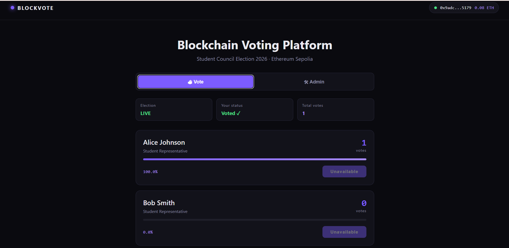
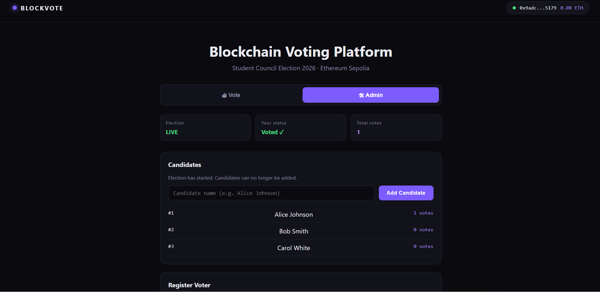

# 🗳️ BlockVote — Blockchain-Based Voting DApp

A decentralized voting application built on Ethereum. Votes are recorded as immutable transactions on the blockchain, election rules are enforced by a smart contract, and results are publicly auditable.

### 🌐 [**Try the Live DApp →**](https://block-vote-lovat.vercel.app)

**Live on Sepolia Testnet** · **Verified on Etherscan** · **React + Solidity + Hardhat**

### 🗳️ BlockVote — Blockchain Voting DApp

A decentralized voting application built on Ethereum Sepolia. 
Votes are recorded as immutable on-chain transactions, election 
rules are enforced by a Solidity smart contract, and results 
are publicly verifiable via Etherscan.

**Stack:** Solidity · Hardhat · React · TypeScript · viem · MetaMask

**Links:**
- 🌐 [Live Demo](https://block-vote-lovat.vercel.app)
- 📂 [Source Code](https://github.com/mxolisi78/BlockVote)
- 📜 [Verified Contract](https://sepolia.etherscan.io/address/0x101b9a965c7a3de05f74b58ce3b3bc83c8c99ba7)

---

## 🔗 Quick Links

| | |
|---|---|
| 🌐 **Live DApp** | [block-vote-lovat.vercel.app](https://block-vote-lovat.vercel.app) |
| 📂 **GitHub** | [github.com/mxolisi78/BlockVote](https://github.com/mxolisi78/BlockVote) |
| 📜 **Verified Contract** | [0x101b9a96... on Etherscan](https://sepolia.etherscan.io/address/0x101b9a965c7a3de05f74b58ce3b3bc83c8c99ba7) |
| 🔗 **Read Contract** | [Etherscan Read tab](https://sepolia.etherscan.io/address/0x101b9a965c7a3de05f74b58ce3b3bc83c8c99ba7#readContract) |
---

## 📌 Contract Information

| | |
|---|---|
| **Network** | Ethereum Sepolia Testnet |
| **Contract Address** | [`0x101b9a965c7a3de05f74b58ce3b3bc83c8c99ba7`](https://sepolia.etherscan.io/address/0x101b9a965c7a3de05f74b58ce3b3bc83c8c99ba7) |
| **Verified Source** | [Etherscan →](https://sepolia.etherscan.io/address/0x101b9a965c7a3de05f74b58ce3b3bc83c8c99ba7#code) |
| **Read Contract** | [Etherscan →](https://sepolia.etherscan.io/address/0x101b9a965c7a3de05f74b58ce3b3bc83c8c99ba7#readContract) |
| **Deployer / Admin** | `0x9aDcEdA839B11dc336fb65102F30E7f0f74C5179` |
| **Solidity Version** | 0.8.34 |
| **License** | MIT |

---

## 🎯 What It Does

BlockVote lets an administrator run a transparent on-chain election:

- Admin **adds candidates** before voting starts
- Admin **registers eligible voters** by wallet address
- Admin **starts** and **ends** the election
- Registered voters **cast exactly one vote** from their MetaMask wallet
- Anyone can **read candidates and vote counts** directly from Etherscan

**Every rule is enforced by the smart contract.** Not by the server, not by the UI — by the code running on Ethereum.

---

## 🔐 Security Features

| Feature | How |
|---------|-----|
| **One-wallet-one-vote** | `hasVoted[address]` flag set on-chain after voting |
| **Admin-only actions** | `modifier onlyAdmin()` — reverts for non-admin |
| **No voting before start** | `require(electionStarted)` check |
| **No voting after end** | `require(!electionEnded)` check |
| **No duplicate voters** | `require(!voters[voter].registered)` check |
| **No invalid candidates** | `require(candidateId > 0 && candidateId <= candidateCount)` |
| **No adding candidates after start** | `require(!electionStarted)` in `addCandidate` |
| **No registration after start** | `require(!electionStarted)` in `registerVoter` |

All rules are also covered by **22 automated tests** (see below).

---

## 🧱 Tech Stack

**Blockchain:**
- Solidity `0.8.34`
- Hardhat 3 (development, testing, deployment)
- Hardhat Ignition (deterministic deployments)
- viem (TypeScript Ethereum client)
- Ethereum Sepolia Testnet

**Frontend:**
- React 18
- TypeScript
- Vite
- viem
- MetaMask wallet integration

**Verification:**
- Etherscan ✅
- Blockscout ✅
- Sourcify ✅

---

## 📂 Project Structure

```
BlockVote/
├── contracts/
│   └── BlockVote.sol                    # The smart contract
│
├── test/
│   └── BlockVote.test.ts                # 22 passing tests
│
├── scripts/
│   ├── read-state.ts                    # Read election state
│   ├── setup-election.ts                # Seed candidates + voters
│   ├── run-election.ts                  # Full lifecycle simulation
│   ├── export-abi.ts                    # Copy ABI to frontend
│   ├── redeploy-sepolia.ts              # Full redeploy + vote
│   └── ...
│
├── ignition/
│   └── modules/
│       └── BlockVote.ts                 # Ignition deployment module
│
├── frontend/                            # React DApp
│   ├── src/
│   │   ├── App.tsx                      # Main UI with tabs
│   │   ├── components/
│   │   │   ├── CandidateCard.tsx
│   │   │   └── AdminPanel.tsx
│   │   └── lib/
│   │       ├── contract.ts              # Address + ABI
│   │       ├── wallet.ts                # MetaMask connection
│   │       └── blockvote.ts             # Chain read/write helpers
│   └── package.json
│
└── hardhat.config.ts
```

---

## 🚀 Running Locally

### Prerequisites

- **Node.js** 18+ (v22 recommended)
- **MetaMask** browser extension
- **Git**

### 1. Clone the repository

```bash
git clone https://github.com/mxolisi78/BlockVote.git
cd BlockVote
```

### 2. Install dependencies

```bash
npm install
```

### 3. Run the test suite

```bash
npx hardhat test
```

Expected output:

```
22 passing (22 nodejs)
```

### 4. Start a local blockchain (optional)

```bash
npx hardhat node
```

### 5. Deploy locally (optional)

```bash
npx hardhat ignition deploy ignition/modules/BlockVote.ts --network localhost
```

### 6. Run the frontend

```bash
cd frontend
npm install
npm run dev
```

Open `http://localhost:5173/`

---

## 🧪 Test Suite

The contract is tested with **22 passing tests** covering:

```
Deployment
  ✔ should set the deployer as admin
  ✔ should set the election name

Candidates
  ✔ should allow admin to add a candidate
  ✔ should allow multiple candidates
  ✔ should prevent non-admin from adding a candidate
  ✔ should prevent adding candidates after election starts

Voter Registration
  ✔ should allow admin to register a voter
  ✔ should reject duplicate voter registration
  ✔ should prevent non-admin from registering a voter

Election
  ✔ should start the election
  ✔ should not start without candidates
  ✔ should prevent non-admin from starting the election

Voting
  ✔ should allow a registered voter to vote
  ✔ should increase total votes after voting
  ✔ should prevent a voter from voting twice
  ✔ should reject an unregistered voter
  ✔ should reject an invalid candidate

Ending Election
  ✔ should prevent voting after election ends
  ✔ should prevent non-admin from ending the election
  ✔ should prevent ending the election before it starts
  ✔ should prevent starting the election twice
  ✔ should prevent ending the election twice
```

Run them with:

```bash
npx hardhat test
```

---

## 📊 Live Deployment (Sepolia)

The contract is deployed and verified on Sepolia:

| | |
|---|---|
| **Contract** | [`0x101b9a965c7a3de05f74b58ce3b3bc83c8c99ba7`](https://sepolia.etherscan.io/address/0x101b9a965c7a3de05f74b58ce3b3bc83c8c99ba7) |
| **Election Name** | Student Council Election 2026 |
| **Candidates** | Alice Johnson, Bob Smith, Carol White |
| **Status** | LIVE |
| **Total Votes** | 1 |

Try it yourself on Etherscan:

1. Open the [Read Contract page](https://sepolia.etherscan.io/address/0x101b9a965c7a3de05f74b58ce3b3bc83c8c99ba7#readContract)
2. Click **`electionName`** → returns `"Student Council Election 2026"`
3. Click **`candidateCount`** → returns `3`
4. Click **`totalVotes`** → returns `1`
5. Call **`getVoterStatus`** with the admin address → returns `{ registered: true, hasVoted: true }`

**All data comes from the Ethereum blockchain — no server involved.**

---

## 🖼️ Screenshots

### 🗳️ Voting UI (Live on Sepolia)


### 🛠️ Admin Dashboard


---

## 🛣️ Roadmap

- [x] Write Solidity smart contract
- [x] Build 22-test suite
- [x] Deploy to local Hardhat node
- [x] Build React frontend with MetaMask
- [x] Deploy to Sepolia testnet
- [x] Verify contract on Etherscan
- [x] Cast a real on-chain vote
- [x] Deploy frontend to Vercel
- [x] Add screenshot gallery to README
- [ ] (Future) Implement zk-proof based anonymous voting
- [ ] (Future) Add candidate self-registration with stake

---

## 📜 License

MIT — see [LICENSE](LICENSE) for details.

---

## 👤 Author

**Mxolisi**
- GitHub: [@mxolisi78](https://github.com/mxolisi78)

---

## ⚠️ Disclaimer

This is an **educational project** demonstrating blockchain voting concepts. It is **not** production-ready for real-world elections. Real election systems require voter identity verification, coercion resistance, accessibility, privacy guarantees, and legal compliance — none of which this project addresses.

The contract is deployed on **Sepolia testnet** where ETH has no real-world value.